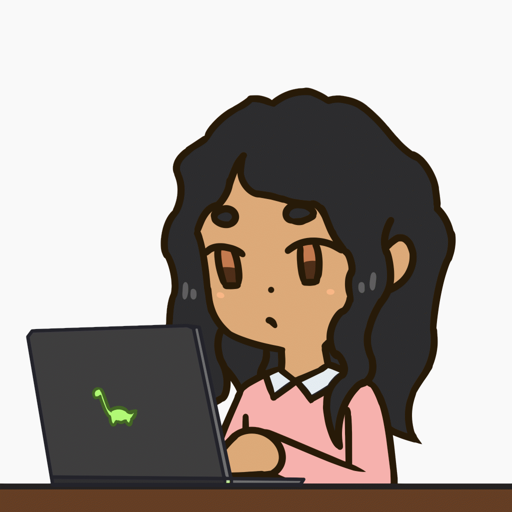

  

<h1 align="center">Hi 👋, I'm Sinchana</h1>

  

<h3 align="center">🎓 4th-year Computer Science Engineering student | 🌐 Data Science Enthusiast</h3>

---

### 🚀 About Me

- 🔭 I’m currently working on **Data Science and Full Stack Web Development Projects**
- 🌱 I’m currently learning advanced **Python libraries**, **Data Structures**, and **System Design**
- 💡 Exploring areas like **Machine Learning**, **Cloud Platforms**, and **API Integrations**
- 📫 Reach me:
  - ✉️ **naik.sinchana13@gmail.com**

---

### 🌐 Connect with Me

  
  

---
### 🛠️ Languages and Tools

  
  
  
  
  
  
  
  
  
  
  

---

### 🔥 GitHub Streak Stats

  

---

### 📊 GitHub Stats & Languages

  
  

---
